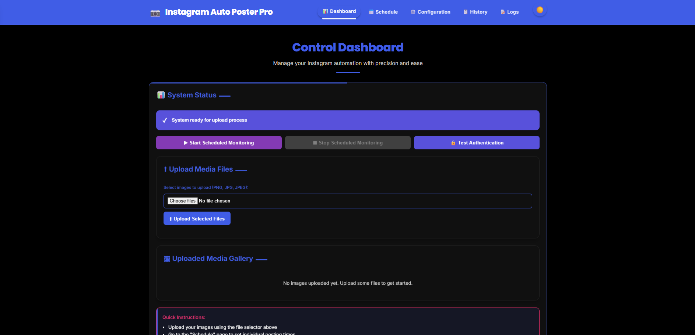

# Instagram Auto Poster Pro

An automated solution for posting images to Instagram with scheduling capabilities, encryption, and a web-based user interface.



## Features

- Automated Instagram posting with configurable delays
- Web-based user interface for easy management
- Schedule posts for specific dates and times
- Encryption for sensitive data (credentials)
- Upload history tracking
- Responsive design with Instagram-themed UI
- Dark/light theme support
- Mobile-responsive interface with hamburger menu

## Prerequisites

- Python 3.7 or higher
- Instagram account credentials
- Pip (Python package manager)

## Installation

1. Clone or download this repository
2. Install the required dependencies:
   ```bash
   pip install -r requirements.txt
   ```

## Configuration

1. Copy the example configuration files:
   ```bash
   cp config_example.json config.json
   cp session_example.json session.json
   ```

2. Update the `config.json` file with your Instagram credentials:
   ```json
   {
       "instagram_username": "your_instagram_username",
       "instagram_password": "your_instagram_password",
       "session_file": "session.json",
       "image_directory": "images/",
       "uploaded_directory": "uploaded/",
       "log_file": "upload.log"
   }
   ```

3. Place images to be uploaded in the `images/` directory

## Usage

### Starting the Web Interface

Run the web interface using the provided batch file:
```bash
run_webui.bat
```

Or manually start it with:
```bash
python instagram_webui.py
```

The web interface will be available at `http://localhost:5000`

### Using the Application

1. **Dashboard**: View the current status and start/stop the upload process
2. **Schedule**: Schedule individual posts for specific dates and times
3. **Configuration**: Update Instagram credentials and paths
4. **History**: View upload history and export it as JSON
5. **Logs**: Monitor real-time logs of the upload process

### File Structure

- `images/` - Directory for images to be uploaded
- `uploaded/` - Directory for images that have been uploaded
- `config.json` - Configuration file with Instagram credentials
- `upload_history.json` - History of uploaded images
- `scheduled_posts.json` - Scheduled posts information
- `session.json` - Instagram session data (auto-generated)

## Security

- Credentials in `config.json` are encrypted using the `cryptography` library
- Session data is stored in `session.json` to avoid repeated logins
- All sensitive data is encrypted at rest

## Important Notes

- The application uses random delays between uploads (5-15 minutes) to avoid bot detection
- Images must be in PNG format and placed in the `images/` directory
- Uploaded images are moved to the `uploaded/` directory to prevent re-uploading
- The application maintains logs in `upload.log`

## Troubleshooting

- If authentication fails, check your credentials in `config.json`
- If uploads fail, check the logs for error messages
- If the session expires, delete `session.json` and restart the application
- Ensure the `images/` directory contains valid PNG files

## Dependencies

- instagrapi - Instagram API wrapper
- Pillow - Image processing library
- Flask - Web framework
- Werkzeug - WSGI utility library
- cryptography - Encryption library

## License

This project is for personal use only.